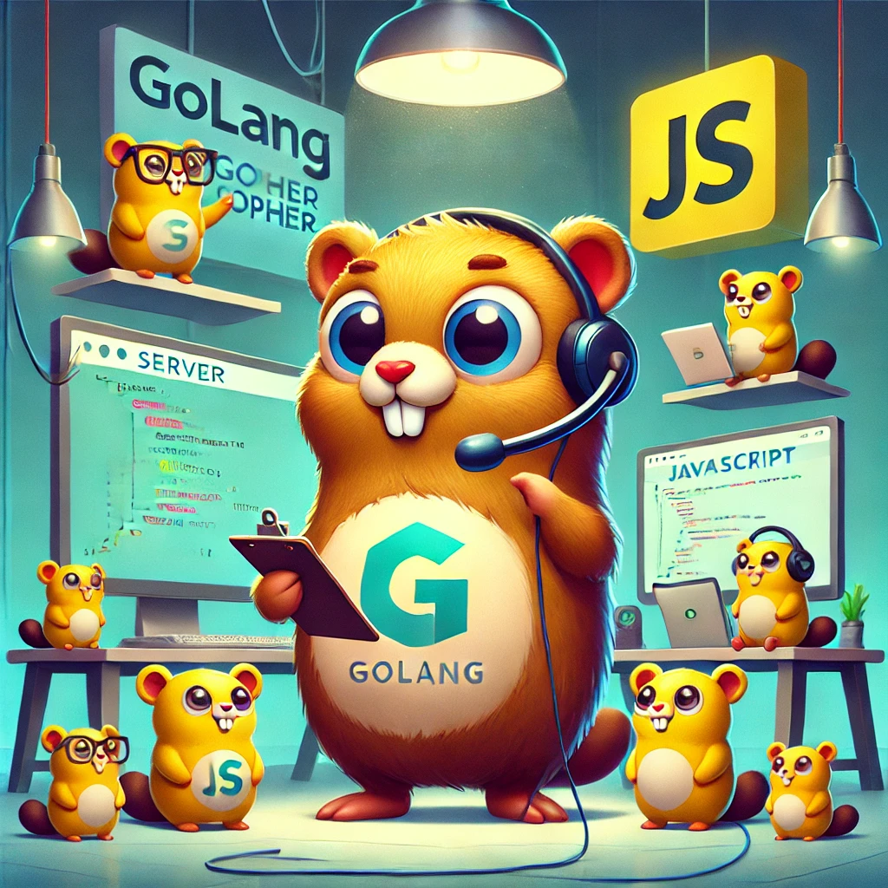

# 📜 ResolveSpec 📜

ResolveSpec is a flexible and powerful REST API specification and implementation that provides GraphQL-like capabilities while maintaining REST simplicity. It allows for dynamic data querying, relationship preloading, and complex filtering through a clean, URL-based interface.

**🆕 New in v2.0**: Database-agnostic architecture with support for GORM, Bun, and other ORMs. Router-flexible design works with Gorilla Mux, Gin, Echo, and more.



## Table of Contents

- [Features](#features)
- [Installation](#installation)
- [Quick Start](#quick-start)
  - [Existing Code (Backward Compatible)](#option-1-existing-code-backward-compatible)
  - [New Database-Agnostic API](#option-2-new-database-agnostic-api)
  - [Router Integration](#router-integration)
- [Migration from v1.x](#migration-from-v1x)
- [Architecture](#architecture)
- [API Structure](#api-structure)
- [Example Usage](#example-usage)
- [Testing](#testing)
- [What's New in v2.0](#whats-new-in-v20)

## Features

- **Dynamic Data Querying**: Select specific columns and relationships to return
- **Relationship Preloading**: Load related entities with custom column selection and filters
- **Complex Filtering**: Apply multiple filters with various operators
- **Sorting**: Multi-column sort support
- **Pagination**: Built-in limit and offset support
- **Computed Columns**: Define virtual columns for complex calculations
- **Custom Operators**: Add custom SQL conditions when needed
- **🆕 Database Agnostic**: Works with GORM, Bun, or any database layer through adapters
- **🆕 Router Flexible**: Integrates with Gorilla Mux, Gin, Echo, or custom routers
- **🆕 Backward Compatible**: Existing code works without changes
- **🆕 Better Testing**: Mockable interfaces for easy unit testing

## API Structure

### URL Patterns
```
/[schema]/[table_or_entity]/[id]
/[schema]/[table_or_entity]
/[schema]/[function]
/[schema]/[virtual]
```

### Request Format

```json
{
  "operation": "read|create|update|delete",
  "data": {
    // For create/update operations
  },
  "options": {
    "preload": [...],
    "columns": [...],
    "filters": [...],
    "sort": [...],
    "limit": number,
    "offset": number,
    "customOperators": [...],
    "computedColumns": [...]
  }
}
```

## Example Usage

### Reading Data with Related Entities
```json
POST /core/users
{
  "operation": "read",
  "options": {
    "columns": ["id", "name", "email"],
    "preload": [
      {
        "relation": "posts",
        "columns": ["id", "title"],
        "filters": [
          {
            "column": "status",
            "operator": "eq",
            "value": "published"
          }
        ]
      }
    ],
    "filters": [
      {
        "column": "active",
        "operator": "eq",
        "value": true
      }
    ],
    "sort": [
      {
        "column": "created_at",
        "direction": "desc"
      }
    ],
    "limit": 10,
    "offset": 0
  }
}
```

## Installation

```bash
go get github.com/Warky-Devs/ResolveSpec
```

## Quick Start

### Option 1: Existing Code (Backward Compatible)

Your existing code continues to work without any changes:

```go
import "github.com/Warky-Devs/ResolveSpec/pkg/resolvespec"

// This still works exactly as before
handler := resolvespec.NewAPIHandler(gormDB)
handler.RegisterModel("core", "users", &User{})
```

## Migration from v1.x

ResolveSpec v2.0 introduces a new database and router abstraction layer while maintaining **100% backward compatibility**. Your existing code will continue to work without any changes.

### Migration Timeline

1. **Phase 1**: Continue using existing API (no changes needed)
2. **Phase 2**: Gradually adopt new constructors when convenient  
3. **Phase 3**: Switch to interface-based approach for new features
4. **Phase 4**: Optionally switch database backends

### Detailed Migration Guide

For detailed migration instructions, examples, and best practices, see [MIGRATION_GUIDE.md](MIGRATION_GUIDE.md).

## Architecture

### Database Abstraction Layer

```
Your Application Code
        ↓
   Handler (Business Logic)  
        ↓
   Database Interface
        ↓
   [GormAdapter] [BunAdapter] [CustomAdapter]
        ↓              ↓           ↓
    [GORM]         [Bun]    [Your ORM]
```

### Supported Database Layers

- **GORM** (default, fully supported)
- **Bun** (ready to use, included in dependencies)
- **Custom ORMs** (implement the `Database` interface)

### Supported Routers

- **Gorilla Mux** (built-in support with `SetupRoutes()`)
- **BunRouter** (built-in support with `SetupBunRouterWithResolveSpec()`)
- **Gin** (manual integration, see examples above)
- **Echo** (manual integration, see examples above)  
- **Custom Routers** (implement request/response adapters)

### Option 2: New Database-Agnostic API

#### With GORM (Recommended Migration Path)
```go
import "github.com/Warky-Devs/ResolveSpec/pkg/resolvespec"

// Create database adapter
dbAdapter := resolvespec.NewGormAdapter(gormDB)

// Create model registry  
registry := resolvespec.NewModelRegistry()
registry.RegisterModel("core.users", &User{})
registry.RegisterModel("core.posts", &Post{})

// Create handler
handler := resolvespec.NewHandler(dbAdapter, registry)
```

#### With Bun ORM
```go
import "github.com/Warky-Devs/ResolveSpec/pkg/resolvespec"
import "github.com/uptrace/bun"

// Create Bun adapter (Bun dependency already included)
dbAdapter := resolvespec.NewBunAdapter(bunDB)

// Rest is identical to GORM
registry := resolvespec.NewModelRegistry()
handler := resolvespec.NewHandler(dbAdapter, registry)
```

### Router Integration

#### Gorilla Mux (Built-in Support)
```go
import "github.com/gorilla/mux"

// Backward compatible way
router := mux.NewRouter()  
resolvespec.SetupRoutes(router, handler)

// Or manually:
router.HandleFunc("/{schema}/{entity}", func(w http.ResponseWriter, r *http.Request) {
    vars := mux.Vars(r)
    handler.Handle(w, r, vars)
}).Methods("POST")
```

#### Gin (Custom Integration)
```go
import "github.com/gin-gonic/gin"

func setupGin(handler *resolvespec.Handler) *gin.Engine {
    r := gin.Default()
    
    r.POST("/:schema/:entity", func(c *gin.Context) {
        params := map[string]string{
            "schema": c.Param("schema"),
            "entity": c.Param("entity"),
        }
        
        // Use new adapter interfaces
        reqAdapter := resolvespec.NewHTTPRequest(c.Request)
        respAdapter := resolvespec.NewHTTPResponseWriter(c.Writer)
        handler.Handle(respAdapter, reqAdapter, params)
    })
    
    return r
}
```

#### Echo (Custom Integration)
```go
import "github.com/labstack/echo/v4"

func setupEcho(handler *resolvespec.Handler) *echo.Echo {
    e := echo.New()
    
    e.POST("/:schema/:entity", func(c echo.Context) error {
        params := map[string]string{
            "schema": c.Param("schema"),
            "entity": c.Param("entity"),
        }
        
        reqAdapter := resolvespec.NewHTTPRequest(c.Request())
        respAdapter := resolvespec.NewHTTPResponseWriter(c.Response().Writer)
        handler.Handle(respAdapter, reqAdapter, params)
        return nil
    })
    
    return e
}
```

#### BunRouter (Built-in Support)
```go
import "github.com/uptrace/bunrouter"

// Simple setup with built-in function
func setupBunRouter(handler *resolvespec.APIHandlerCompat) *bunrouter.Router {
    router := bunrouter.New()
    resolvespec.SetupBunRouterWithResolveSpec(router, handler)
    return router
}

// Or use the adapter
func setupBunRouterAdapter() *resolvespec.StandardBunRouterAdapter {
    routerAdapter := resolvespec.NewStandardBunRouterAdapter()
    
    // Register routes manually
    routerAdapter.RegisterRouteWithParams("POST", "/:schema/:entity", 
        []string{"schema", "entity"}, 
        func(w http.ResponseWriter, r *http.Request, params map[string]string) {
            // Your handler logic
        })
    
    return routerAdapter
}

// Full uptrace stack (bunrouter + Bun ORM)
func setupFullUptrace(bunDB *bun.DB) *bunrouter.Router {
    // Database adapter
    dbAdapter := resolvespec.NewBunAdapter(bunDB)
    registry := resolvespec.NewModelRegistry()
    handler := resolvespec.NewHandler(dbAdapter, registry)
    
    // Router
    router := resolvespec.NewStandardBunRouterAdapter()
    resolvespec.SetupBunRouterWithResolveSpec(router.GetBunRouter(), 
        &resolvespec.APIHandlerCompat{
            newHandler: handler,
        })
    
    return router.GetBunRouter()
}
```

## Configuration

### Model Registration
```go
type User struct {
    ID    uint   `json:"id" gorm:"primaryKey"`
    Name  string `json:"name"`
    Email string `json:"email"`
    Posts []Post `json:"posts,omitempty" gorm:"foreignKey:UserID"`
}

handler.RegisterModel("core", "users", &User{})
```

## Features in Detail

### Filtering
Supported operators:
- eq: Equal
- neq: Not Equal
- gt: Greater Than
- gte: Greater Than or Equal
- lt: Less Than
- lte: Less Than or Equal
- like: LIKE pattern matching
- ilike: Case-insensitive LIKE
- in: IN clause

### Sorting
Support for multiple sort criteria with direction:
```json
"sort": [
  {
    "column": "created_at",
    "direction": "desc"
  },
  {
    "column": "name",
    "direction": "asc"
  }
]
```

### Computed Columns
Define virtual columns using SQL expressions:
```json
"computedColumns": [
  {
    "name": "full_name",
    "expression": "CONCAT(first_name, ' ', last_name)"
  }
]
```

## Testing

### With New Architecture (Mockable)

```go
import "github.com/stretchr/testify/mock"

// Create mock database
type MockDatabase struct {
    mock.Mock
}

func (m *MockDatabase) NewSelect() resolvespec.SelectQuery {
    args := m.Called()
    return args.Get(0).(resolvespec.SelectQuery)
}

// Test your handler with mocks
func TestHandler(t *testing.T) {
    mockDB := &MockDatabase{}
    mockRegistry := resolvespec.NewModelRegistry()
    handler := resolvespec.NewHandler(mockDB, mockRegistry)
    
    // Setup mock expectations
    mockDB.On("NewSelect").Return(&MockSelectQuery{})
    
    // Test your logic
    // ... test code
}
```

## Security Considerations

- Implement proper authentication and authorization
- Validate all input parameters  
- Use prepared statements (handled by GORM/Bun/your ORM)
- Implement rate limiting
- Control access at schema/entity level
- **New**: Database abstraction layer provides additional security through interface boundaries

## Contributing

1. Fork the repository
2. Create your feature branch (`git checkout -b feature/amazing-feature`)
3. Commit your changes (`git commit -m 'Add some amazing feature'`)
4. Push to the branch (`git push origin feature/amazing-feature`)
5. Open a Pull Request

## License

This project is licensed under the MIT License - see the [LICENSE](LICENSE) file for details. 

## What's New in v2.0

### Breaking Changes
- **None!** Full backward compatibility maintained

### New Features
- **Database Abstraction**: Support for GORM, Bun, and custom ORMs
- **Router Flexibility**: Works with any HTTP router through adapters
- **BunRouter Integration**: Built-in support for uptrace/bunrouter
- **Better Architecture**: Clean separation of concerns with interfaces
- **Enhanced Testing**: Mockable interfaces for comprehensive testing
- **Migration Guide**: Step-by-step migration instructions

### Performance Improvements
- More efficient query building through interface design
- Reduced coupling between components
- Better memory management with interface boundaries

## Acknowledgments

- Inspired by REST, OData, and GraphQL's flexibility
- **Database Support**: [GORM](https://gorm.io) and [Bun](https://bun.uptrace.dev/)
- **Router Support**: Gorilla Mux (built-in), Gin, Echo, and others through adapters
- Slogan generated using DALL-E
- AI used for documentation checking and correction
- Community feedback and contributions that made v2.0 possible